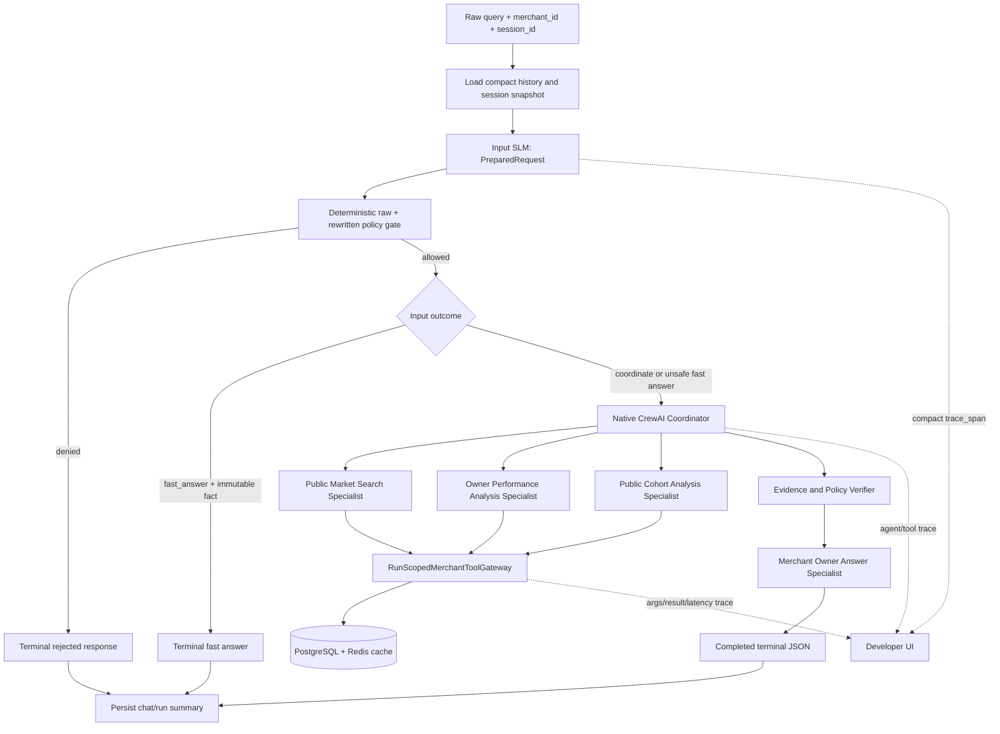

# Merchant Agent — Week 2–3: Simplified Native Runtime, Data Contracts and Developer Tracing

> Cập nhật: 2026-07-31  
> Trạng thái: kiến trúc mục tiêu đang được chạy bởi merchant flow hiện tại. Tài liệu này thay thế mô tả HITL, direct lookup, semantic-span persistence/replay và các ghi nhận provider/eval lịch sử.

## 1. Mục tiêu Week 2–3

Xây dựng một pipeline dễ quan sát và ít quyết định cứng:

- Input SLM chỉ chuẩn hoá câu hỏi theo context và đề xuất `fast_answer` hoặc `coordinate`.
- Python giữ các invariant không được giao cho model: scope/privacy, owner identity, schema validation, cache, truy cập DB và giới hạn dữ liệu.
- Coordinator nhận câu hỏi đã chuẩn hoá, history gọn và context owner; nó tự lập kế hoạch, delegate specialist và quyết định tool cần dùng.
- UI developer nhận trace compact ngay khi xảy ra qua SSE.

Pipeline không còn có direct lookup route, pending HITL, `needs_clarification`, hay semantic span writer/replay.

## 2. Kiến trúc active

### 2.1 Quy tắc ownership

| Boundary | Làm | Không làm |
|---|---|---|
| Input SLM | Rewrite theo history/context, resolve reference khi có bằng chứng, đề xuất `fast_answer` hoặc `coordinate` | Không plan, delegate, gọi tool, trả merchant fact mới, hay tự reject policy |
| Policy gate | Đánh giá raw query và rewritten query; raw denial luôn thắng | Không chọn tool hoặc tạo answer business |
| Fast answer | Trả text immutable đã được bind chính xác với rewritten query | Không dùng menu, giờ mở cửa, rating, search hay dữ liệu có thể đổi |
| Coordinator | Chọn specialist/tool tối thiểu, tổng hợp observation thành terminal answer | Không bypass gateway hoặc tự tạo evidence |
| Gateway | Bind owner, validate schema, normalize/filter arguments, cache, tạo session DB an toàn theo tool | Không quyết định intent/route hoặc tổng hợp câu trả lời |
| Verifier + answer specialist | Kiểm tra evidence và trả lời tiếng Việt có căn cứ | Không mở rộng scope bằng tool riêng |

`reject` là kết quả của policy gate, không phải lựa chọn của Input SLM. Nếu `fast_answer` không có immutable fact khớp tuyệt đối, flow hạ về `coordinate`.

### 2.2 Trình tự xử lý một turn

1. API nhận `merchant_id`, `message`, optional `session_id`, optional `user_id`.
2. Flow lấy/tạo `ChatSession`, tối đa ba lượt history gọn và `context_snapshot_json`.
3. Input SLM nhận raw query, history, session snapshot và owner context trong prompt có giới hạn token. Nó trả `PreparedRequest`; lỗi provider/schema chỉ dẫn đến fallback `coordinate`.
4. `MerchantDataPolicy` kiểm tra cả raw và rewritten query. Request private/out-of-scope kết thúc trước khi tool hoặc crew chạy.
5. Router trả fast answer chỉ khi SLM đề xuất fast answer **và** snapshot có immutable value đã bind với exact rewritten query. Mọi trường hợp còn lại vào coordinator.
6. Coordinator dùng `Process.hierarchical`, delegate vừa đủ specialist và nhận observation qua `RunScopedMerchantToolGateway`.
7. Coordinator trả duy nhất `{"status":"completed","answer":"..."}`. Nếu thiếu evidence, answer nêu rõ giới hạn; không giữ pending state để hỏi lại.
8. Flow lưu agent message, run summary và legacy agent events; stream `execution_finish` cho UI.

## 3. Data contracts và cách sử dụng field

### 3.1 API request, session và input contract

| Nguồn | Field | Cách dùng |
|---|---|---|
| `MerchantChatRequest` | `merchant_id` | Owner identity của run; gateway bind vào mọi owner-private tool. Không lấy từ LLM tool arguments. |
|  | `message` | Raw query cho policy, Input SLM và audit trace; không dùng trực tiếp như coordinator instruction sau rewrite. |
|  | `session_id` | Khóa history/snapshot; tạo session mới nếu thiếu. |
|  | `user_id` | Gắn `ChatSession`/`AgentRun` khi có. |
| `ChatSession.context_snapshot_json` | `merchant_id` | Context owner tối thiểu của session. |
|  | `merchant_agentic.immutable_facts` | Chỉ nguồn hợp lệ cho fast answer. Mỗi entry phải có `source_stability="immutable"`, `normalized_query`, `value`. |
|  | `merchant_agentic.selected_public_merchant`, `merchant_agentic.last_public_search` | Memory public do answer đã hoàn tất ghi lại; Input SLM/coordinator có thể xem như evidence. Không kích hoạt direct route. |
| `ChatMessage` | `sender`, `text`, `trace_id`, `structured_payload_json` | Lưu user/agent turn, liên kết message với trace và metadata response. |
| `PreparedRequest` | `rewritten_query` | Instruction authoritative duy nhất cho coordinator. |
|  | `resolved_references[]` | Merchant/location/menu reference từ context; chỉ evidence, không phải authority để gọi tool. |
|  | `scope_candidate`, `missing_context` | Signal quan sát của SLM cho trace/coordinator. Policy vẫn quyết định scope cuối. |
|  | `proposed_outcome` | Chỉ `fast_answer` hoặc `coordinate`. |

### 3.2 Merchant location, H3 và discovery data

| Model | Field | Cách dùng runtime |
|---|---|---|
| `Merchant` | `merchant_id`, `name`, `cuisine`, `category`, `address`, `city`, `city_slug` | Projection public cho search/detail và answer/UI. `city_slug` được canonicalise trước retrieval. |
|  | `lat`, `lng` | Anchor cho nearby search, distance calculation, map UI. Cặp toạ độ phải cùng tồn tại hoặc cùng null. |
|  | `h3_index_6` | Cell phủ rộng: fallback mở rộng nearby search khi không có candidate ở độ phân giải hẹp. |
|  | `merchant_h3_cell` | H3 resolution 8, cell runtime mặc định cho nearby candidate retrieval. |
|  | `h3_index_9` | Cell hẹp để candidate retrieval chính xác hơn gần anchor. |
|  | `opens_at`, `closes_at`, `timezone` | Chỉ trả từ public-detail tool khi coordinator hỏi giờ hoạt động; không fast answer. |
|  | `is_active` | Bắt buộc true cho public search/detail. |
|  | `is_demo_target` | Dùng để giới hạn merchant hiển thị ở developer/demo UI khi endpoint/query áp dụng filter đó; không thay thế policy runtime. |
| `MenuItem` | `merchant_id`, `name`, `price`, `discount_price`, `category`, `is_available`, `total_like` | Menu public/owner tool. Public detail chỉ trả item đang available, giới hạn 1–50 và sort popularity/name. |
| `MerchantRating` | platform rating | Projection public trong search/detail; không dùng để suy luận cohort aggregate nếu chưa gọi aggregate tool. |
| Search input | `query`, `city`, `cuisine`, `district`, tags, price/rating, `anchor_merchant_id`, `radius_km`, `sort_by`, `limit` | Gateway validate và ground optional filters vào những gì user thực sự nói. `city` được chuẩn hoá; `anchor_merchant_id` là center nearby search. |

Nearby retrieval dùng H3 candidate cells theo độ phân giải từ hẹp đến rộng, sau đó lọc khoảng cách haversine và các field filter. Khi không tìm thấy candidate ở cell hẹp, search tự mở rộng; LLM không tự thử lại nhiều lần để bù cho index.

### 3.3 Gateway/tool data

`AgenticRunContext` giữ `trace_id`, `session_id`, `owner_merchant_id`, optional `user_id`, và raw `user_query`. Gateway giữ context này theo đúng một run.

| Tool family | Input có thể do LLM chọn | Data output / guard |
|---|---|---|
| `search_merchants` | Public filters có schema | Public merchant projection, `cohort_ref`, cache status, normalized args, latency. |
| `get_public_merchant_detail` | `merchant_id`, `menu_limit` | Public identity, address/location, hours/timezone, ratings, available menu. Đây là tool của Market Search Specialist, không phải direct route. |
| Owner profile/metrics/reviews/complaints/menu/images | Chỉ filter hợp lệ | Owner ID được gateway inject từ `owner_merchant_id`; LLM không thể đổi target. |
| Cohort aggregate/comparison | `cohort_ref` hoặc merchant IDs đã quan sát | Claims group phải dựa trên aggregate; public competitor private data bị chặn. |
| Diagnosis/recommendation | Owner-bound evidence scope | Không chạy nếu request không đòi hỏi owner analysis. |

Mọi tool invocation phát trace chứa tên agent/tool, args đã sanitize/ground, correlation ID, cache/SQL signal, status, bounded output summary và latency. Gateway có DB session riêng cho tool call để tránh dùng chung SQLAlchemy session giữa CrewAI worker threads.

### 3.4 Run, response và trace data

| Contract | Field | Cách dùng |
|---|---|---|
| `AgentRun` | `trace_id`, `session_id`, `user_id`, `crew_name`, `intent`, `status`, `started_at`, `finished_at`, `error_code`, `token_usage_json` | Lifecycle và historical trace summary. |
| Legacy `AgentEvent` | `event_type`, agent/task/tool name, `output_summary_json`, `duration_ms`, `status`, `error_code` | Persisted history/inspection. Không dùng semantic span persistence mới. |
| SSE `trace_span` | `trace_id`, `seq`, `span_id`, `phase`, `kind`, actor, `display`, `metrics`, `debug` | Developer UI nhận ngay; `display` luôn có `title`, `summary`, `status`. Span không được ghi/replay từ DB. |
| SSE `execution_finish` | `trace_id`, terminal `status`, `capabilities`, `rewritten_query`, `token_usage`, `duration_ms`, `merchants`, `evidence_status` | Đóng state streaming của UI và gắn response với trace. |
| Flow response | `trace_id`, `session_id`, `merchant_id`, `capabilities`, `rewritten_query`, `reply`, `token_usage`, `trace_summary`, `duration_ms`, `status` | Payload của `/chat`; `/chat/stream` tách reply thành token chunks và kết thúc bằng `execution_finish`. |

`trace_span` là best-effort realtime signal: nếu browser refresh hoặc stream đứt, UI không replay semantic timeline. Lịch sử vẫn có legacy run/event records qua `GET /api/v1/agent/runs/{trace_id}`.

## 4. Prompt và delegation contract

### 4.1 Input SLM

Prompt Input SLM có dynamic input giới hạn 1,600 token và output tối đa 300 token. Context sections là raw query, ba lượt history gần nhất, session state và owner context; sensitive values được redact. Có tối đa một lần schema repair. Khi không gọi/parse được model, fallback giữ raw query và đề xuất `coordinate`.

Fast answer chỉ dùng cho fact static đã explicit trong session và bind chính xác query. Menu, giờ mở cửa, rating, vị trí, search result và mọi dữ liệu merchant đều phải qua coordinator/gateway vì có thể đổi.

### 4.2 Coordinator

Coordinator prompt nhận:

- `rewritten_query` là instruction authoritative;
- `resolved_references`, compact history và owner context chỉ là evidence;
- dynamic context bị giới hạn 2,400 token;
- temperature cấu hình `0`.

Coordinator delegate tối thiểu. Public discovery/detail đi Market Search Specialist; owner analysis đi Owner Performance Analysis Specialist; group claim phải đi Public Cohort Analysis Specialist; analytical/private output được Evidence and Policy Verifier kiểm tra trước Merchant Owner Answer Specialist. Terminal output luôn là completed JSON duy nhất.

## 5. Observability và UI developer

Developer UI không dựng mock trace. Trong một streaming turn nó render:

1. input/session load và Input SLM outcome;
2. policy/route decision;
3. coordinator delegate/agent action;
4. tool name, sanitized args, compact result, status và latency;
5. LLM token/latency events khi CrewAI emit;
6. terminal duration, token usage và merchant records đã quan sát.

UI map chỉ render merchant records thực tế từ tool results. Cache/session floating panel hiển thị snapshot/cache events đã sanitize. Không render hidden reasoning, raw DB rows, secrets, hoặc unbounded tool payload.

## 6. Error handling và safe fallback

- Input provider/schema failure → deterministic prepared request `coordinate`; không đoán answer.
- Raw hoặc rewritten policy deny → terminal refusal, không Crew/tool.
- Coordinator không có LLM → terminal failed response, không fixed plan.
- Tool thiếu data/không tìm thấy → coordinator kết thúc với limitation grounded, không loop retry vô hạn.
- Tool/crew exception → run marked failed, error event và `execution_finish: FAILED` được stream.
- Trace callback/UI lỗi không được làm hỏng chat execution.

## 7. Week 2–3 delivery checklist

### Done / active

- Native hierarchical CrewAI coordinator, run-scoped tool gateway và owner binding.
- Input SLM contract với hai model outcomes; deterministic policy gate và immutable fast answer.
- Adaptive H3 nearby retrieval trên resolution 9 → 8 → 6.
- Compact realtime SSE semantic trace; legacy run/event history.
- Public detail là coordinator tool; direct lookup, HITL và semantic persistence/replay đã loại bỏ.

### Next validation work

1. Đánh giá Input SLM trên follow-up/context, scope deny và fast-answer safety; giữ dataset đa-turn thay vì route keyword fixtures.
2. Đo mỗi request: số LLM/tool call, latency, token usage, retry/delegation count và H3 expansion level.
3. Thêm golden runtime cases cho nearby dish search, menu/hours follow-up, owner-private refusal, no-result H3 expansion và multi-question loop.
4. Review prompt sau runtime evidence: giảm context/tool/delegation thừa trước khi thay model hay thêm rule.
5. Chỉ công bố full-suite/live-eval pass khi có output runner hoàn tất và trace artifact tương ứng.

## 8. Source-of-truth files

| Concern | File |
|---|---|
| Chat lifecycle and terminal response | `backend/flows/merchant_flow.py` |
| Input schema | `backend/models/merchant_input.py` |
| Input SLM prompt/service/router | `backend/agents/merchant/input_analyzer_prompt.py`, `backend/services/merchant_input_preparation.py`, `backend/services/merchant_input_router.py` |
| Coordinator and specialist prompts | `backend/agents/merchant/native_crew.py` |
| Gateway and tool access | `backend/tools/merchant/gateway.py` |
| Search/H3 and public details | `backend/tools/merchant/search_tool.py`, `backend/services/geo/h3_index.py`, `backend/tools/merchant/public_detail_tool.py` |
| DB contracts | `backend/database/models.py` |
| Chat/SSE API | `backend/routes/merchant_agent_routes.py` |
| Developer UI | `frontend/src/merchant/` |
