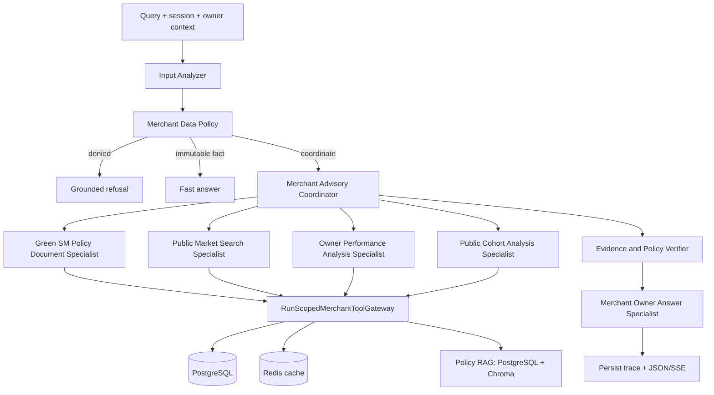

# Merchant Agent - Week 3

> Cap nhat: 2026-08-06  
> Pham vi: hierarchical agent pipeline, Policy RAG, tool gateway va tracing.

## 1. Pipeline moi



Luong xu ly:

1. Input Analyzer giu nguyen operation cua user, rewrite theo evidence trong
   history/session va tra `PreparedRequest`.
2. `MerchantDataPolicy` kiem tra raw query va rewritten query truoc khi crew/tool
   duoc chay.
3. Immutable fact da bind chinh xac co the tra nhanh; cac yeu cau data/phan tich
   di vao hierarchical coordinator.
4. Coordinator delegate toi da 4 specialist va su dung toi da 4 business tool
   calls trong mot turn.
5. Specialist chi truy cap tool qua gateway; owner ID duoc bind theo run va
   competitor chi duoc tra public projection.
6. Analytical claims qua verifier, sau do answer specialist viet cau tra loi
   tieng Viet tu evidence da duyet.
7. Agent, tool, SQL/cache, LLM latency va token usage duoc persist va stream toi
   Developer UI. Token duoc cong theo tung semantic `LLM response` span.

## 2. Agents

| Agent | Vai tro |
|---|---|
| Merchant Advisory Coordinator | Lap ke hoach toi thieu, delegate va ket thuc request. |
| Green SM Policy Document Specialist | Tim policy/procedure Green SM trong corpus RAG va tra passage kem nguon. |
| Public Market Search Specialist | Tim merchant public hoac lay detail cua merchant da resolve. |
| Public Cohort Analysis Specialist | Tong hop cohort public va so sanh owner voi cohort. |
| Owner Performance Analysis Specialist | Lay profile, metrics, reviews, complaints, menu/image va owner diagnosis/action. |
| Evidence and Policy Verifier | Doi chieu subject, metric, scope, value va policy; khong co tool. |
| Merchant Owner Answer Specialist | Viet final answer ngan gon tu approved dossier; khong co tool. |

## 3. Tools

| Nhom | Tools |
|---|---|
| Policy RAG | `search_policy_documents` |
| Public market | `search_merchants`, `get_public_merchant_detail` |
| Public cohort | `aggregate_public_merchant_cohort`, `compare_owner_to_public_cohort`, `compare_owner_to_nearby_public_merchants` |
| Owner data | `get_owner_profile_summary`, `get_owner_operational_metrics`, `get_owner_reviews`, `get_owner_complaints`, `get_owner_menu_and_food_images` |
| Owner analysis | `compare_merchant_images`, `diagnose_owner_merchant`, `recommend_owner_improvements` |

`get_public_merchant_detail` chi xuat hien sau khi merchant ID da duoc resolve.
Cohort tool chi dung merchant IDs hoac `search_ref` da quan sat trong cung run.

## 4. Thay doi chinh

- Thay fixed routing/keyword branch bang Input Analyzer va hierarchical
  coordinator dung prompt contract tong quat.
- Them hard prompt budget cho delegation/tool call, cung iteration va execution
  timeout o runtime.
- Gom validation, owner binding, public projection, cache va tool trace vao
  `RunScopedMerchantToolGateway`.
- Them Policy RAG: PostgreSQL la authoritative content store, Chroma luu vector
  index, specialist tra passage cung provenance.
- Persist semantic spans va hien thi execution timeline, policy evidence,
  latency/token totals tren Developer UI.
- Redis adapter cung cap persistent cache va memory fallback.
- Token accounting dung per-call semantic spans, tranh CrewAI delegation total
  bi cong lap.

## 5. Plan implement Policy Documents

### P0 - Foundation (da co)

- Migration `policy_documents` va `policy_document_chunks`.
- `PolicyRagService.sync_index()` va semantic search qua Chroma.
- Pydantic retrieval contracts, gateway tool va Policy Document Specialist.
- Unit tests cho hydrate metadata va index sync co ban.

### P1 - Source registry va governance

- Dinh nghia registry cho tung nguon: `source_url`, title, category, authority,
  effective/update date, access rule va trang thai phe duyet.
- Chot taxonomy category va owner duyet nguon truoc ingestion.
- Luu checksum va fetch metadata de audit version; chi ingest tai lieu duoc phep.

### P2 - Ingestion pipeline

- Them downloader cho cac format duoc duyet, timeout/retry va content-type
  validation.
- Parse heading/table/list, normalize text va chunk theo `section_path`; giu
  stable `document_id`/`chunk_id` tu source + content hash.
- Upsert document/chunk theo transaction; danh dau tai lieu thay doi, chunk bi
  xoa va parse failure. Khong publish document parse do dang.

### P3 - Incremental vector indexing

- Embed chi chunk moi/thay doi; xoa vector stale khi chunk bi xoa.
- Version collection theo embedding model/dimensions va tao index manifest gom
  corpus hash, model, dimensions, indexed time va counts.
- Them atomic rebuild/swap de search khong doc index dang cap nhat.

### P4 - Retrieval quality va safety

- Chuan hoa query/category, top-k, threshold, deduplicate chunk va bounded
  context.
- Bao toan title, URL, section, policy date va relevance trong moi citation.
- Xem document text la data, sanitize prompt-injection-like content va gioi han
  corpus vao nguon Green SM da duyet.
- Khi khong du evidence, tra coverage gap thay vi suy dien policy.

### P5 - Operations va evaluation

- Them CLI/job `ingest`, `sync-index`, `rebuild-index`, `status` va dry-run.
- Them metrics cho fetch/parse/index/search latency, document/chunk counts,
  stale vectors va zero-result rate.
- Tao golden queries theo category; do source accuracy, section relevance,
  citation completeness va no-answer correctness.
- Chay integration test PostgreSQL + Chroma va end-to-end agent trace truoc khi
  bat scheduled ingestion.

## 6. Acceptance criteria

- Moi source co approval, checksum va version provenance.
- Update/xoa document duoc phan anh trong PostgreSQL va Chroma ma khong con
  stale chunk.
- Moi policy claim trong final answer co title, URL, section va passage ho tro.
- Corpus gap tao no-answer/limitation ro rang.
- Rebuild co rollback, manifest va test artifact; secrets/document payload
  khong bi lo qua trace.

## 7. Source of truth

```text
backend/flows/merchant_flow.py
backend/agents/merchant/native_crew.py
backend/tools/merchant/gateway.py
backend/services/policy_rag_service.py
backend/models/policy_rag.py
backend/database/models.py
backend/migrations/versions/h3c4d5e6f7g8_add_policy_document_chunks.py
backend/services/merchant_trace_collector.py
frontend/src/merchant/components/chat/AgentThinkingAccordion.tsx
```
