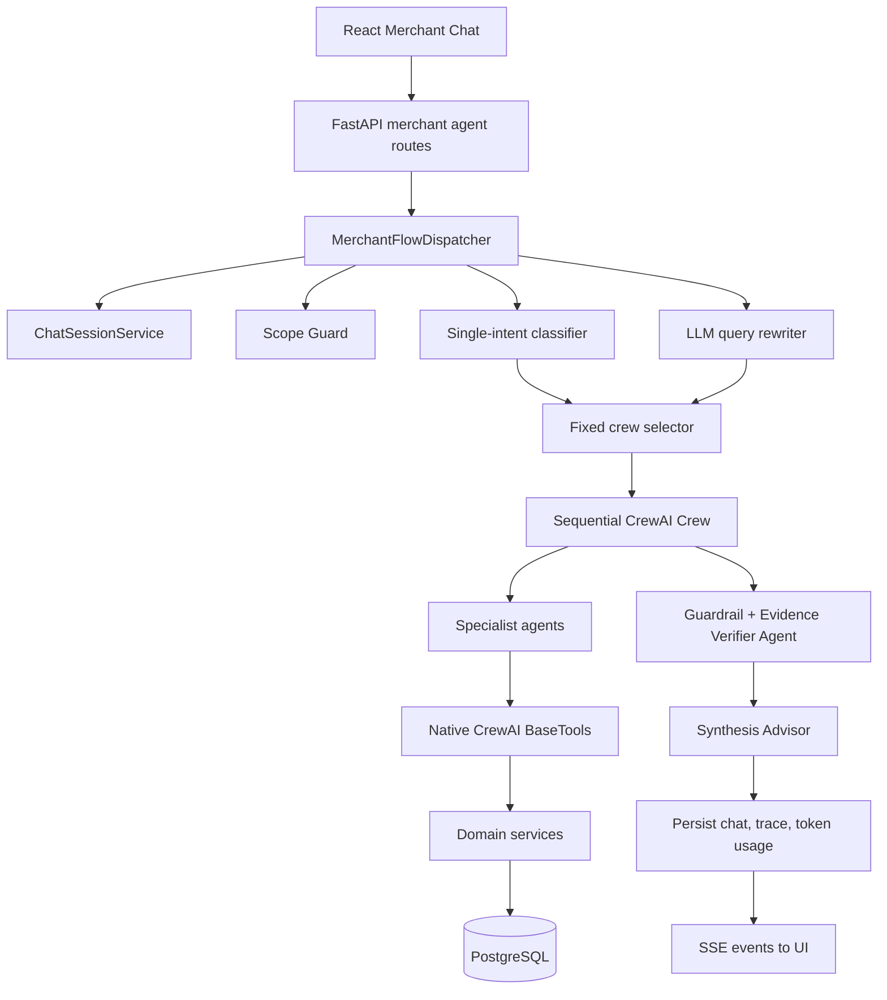

# Merchant Agent — Week 1 Architecture

> Thời điểm: trước đợt refactor multi-capability ngày 2026-07-27  
> Trạng thái: kiến trúc cũ, đã được thay thế bởi Week 2  
> Nguồn đối chiếu: thiết kế ngày 2026-07-21 và phiên bản `HEAD` của
> `backend/flows/merchant_flow.py` trước refactor

## 1. Mục tiêu Week 1

Week 1 xây dựng Merchant Advisor theo mô hình Native CrewAI 1.15.5. Mục tiêu
chính là có một chatbot đa lượt cho merchant owner, dùng specialist agents và
tool có cấu trúc để:

- xem profile và chỉ số vận hành của quán;
- chẩn đoán điểm yếu;
- sinh khuyến nghị cải thiện;
- tìm hoặc so sánh đối thủ;
- lưu session, trace và token usage;
- stream tiến trình agent qua SSE.

Đây là giai đoạn chuyển từ các service rời rạc sang một agent runtime có
`@CrewBase`, `Agent`, `Task`, `Crew` và Native `BaseTool`.

## 2. Kiến trúc tổng quan



Điểm điều phối trung tâm là `MerchantFlowDispatcher`. Sau khi scope guard cho
phép, hệ thống phân loại câu hỏi vào đúng một intent, chọn một crew cố định và
để CrewAI chạy tuần tự các task của crew đó.

## 3. Runtime request flow

```text
HTTP/SSE request
  -> tạo hoặc đọc chat session
  -> lưu user message
  -> scope guard
  -> lấy tối đa 3 lượt history
  -> classify_intent(raw message)
  -> rewrite_query(raw message, history)
  -> build_crew_for_intent(one intent)
  -> CrewAI kickoff
  -> agents tự chọn tool trong allow-list
  -> evidence guardrail / verifier nếu crew có diagnosis
  -> synthesis agent
  -> lưu reply, trace và CrewAI token usage
  -> trả JSON hoặc SSE
```

Intent được phân loại từ raw message. Rewrite có dùng history nhưng kết quả
rewrite không được đưa ngược lại vào bước phân loại intent.

## 4. Single-intent router

Classifier dùng small LLM và buộc chọn đúng một trong năm nhãn:

| Intent | Ý nghĩa | Crew được dựng |
|---|---|---|
| `search` | Tìm quán, món hoặc địa điểm | Competitor Agent → Synthesis |
| `benchmark` | So sánh đối thủ theo vị trí | Competitor Agent → Synthesis |
| `weakness_explanation` | Chẩn đoán hoặc đề xuất cải thiện | Profile → Diagnosis → Recommendation → Evidence Verifier → Synthesis |
| `ops_analysis` | Metrics, complaints, menu, profile | Profile Analyst → Synthesis |
| `general_chat` | Chào hỏi hoặc không xác định | Synthesis only |

Nếu LLM classifier lỗi hoặc output không hợp lệ, fallback là
`general_chat`. Một câu compound vẫn chỉ nhận được một intent, do đó không thể
biểu diễn đầy đủ chuỗi như “tìm → phân tích nhóm → so sánh → đề xuất”.

## 5. Crew và agent

`MerchantAdvisorCrew` khai báo agent/task bằng decorator chuẩn CrewAI:

| Agent | Trách nhiệm Week 1 | Tool chính |
|---|---|---|
| `merchant_coordinator` | Điều phối và đọc metadata | Profile summary, metadata catalog |
| `merchant_profile_analyst` | Phân tích profile, metrics, complaints, menu/images | Owner profile tools |
| `diagnosis` | Tìm các chiều yếu và nguyên nhân | Profile, metrics, complaints, diagnosis |
| `recommendation` | Sinh hành động cải thiện | Profile, trending dishes, recommendation |
| `competitor` | Search và benchmark | Search, trends, competitor benchmark |
| `evidence_verifier` | Kiểm tra grounding bằng LLM | Profile, complaints |
| `synthesis_advisor` | Viết câu trả lời cuối | Không có tool |

Chỉ coordinator được bật delegation. Các specialist chạy
`allow_delegation=False`. Tuy vậy, đường chạy chat thực tế chủ yếu dựng các
crew cố định theo intent thay vì để coordinator tạo một plan linh hoạt.

## 6. Fixed crew assembly

### 6.1 Search

```text
search_market_task
  -> synthesis_chat_task
```

### 6.2 Benchmark

```text
compare_competitors_task
  -> synthesis_chat_task
```

### 6.3 Weakness, diagnosis hoặc recommendation

```text
analyze_profile_task
  -> diagnose_merchant_task
  -> recommend_improvements_task
  -> verify_evidence_task
  -> synthesis_chat_task
```

Ba intent weakness/diagnosis/recommendation dùng chung một pipeline đầy đủ.
Ngay cả khi merchant chỉ hỏi một phần, toàn bộ chuỗi profile, diagnosis,
recommendation và verifier vẫn có thể chạy.

### 6.4 Operations/profile

```text
analyze_profile_task
  -> synthesis_chat_task
```

### 6.5 General chat

```text
synthesis_chat_task
```

## 7. Tool layer

Week 1 đã có Native CrewAI wrappers và agent-tool allow-list. Các nhóm tool
chính:

- `get_merchant_profile_summary`;
- `get_merchant_metadata_catalog`;
- `get_merchant_operational_metrics`;
- `get_merchant_complaints`;
- `get_menu_and_food_images`;
- `search_merchants`;
- `search_trending_dishes`;
- `compare_merchant_benchmark`;
- `diagnose_merchant`;
- `recommend_improvements`.

Tool wrappers gọi domain service hoặc truy vấn dữ liệu có cấu trúc. Allow-list
ngăn agent gọi tool không được khai báo, nhưng chưa có một policy service tập
trung để phân biệt owner-private và competitor-public ở mọi bước.

## 8. Evidence verification Week 1

Evidence được kiểm tra theo hai lớp:

### Layer 1 — CrewAI task guardrail

`validate_evidence_guardrail` kiểm tra output diagnosis:

- payload là JSON object;
- có danh sách `causes`;
- tối đa năm nguyên nhân;
- dimension thuộc tập cho phép;
- score nằm trong khoảng `0..1`;
- mỗi nguyên nhân có ít nhất một `evidence_ref`.

Guardrail này chủ yếu kiểm tra shape. Nó chưa resolve toàn bộ reference tới
record thật và chưa đối chiếu mọi con số được trích dẫn với source value.

### Layer 2 — Evidence Verifier Agent

Một small LLM agent đọc profile/complaints và đánh giá semantic grounding trước
khi synthesis. Đây là lớp kiểm tra mang tính xác suất; LLM verifier vẫn có thể
bỏ sót hoặc diễn giải quá mức.

## 9. Session, trace và SSE

Week 1 đã hỗ trợ:

- `chat_sessions` và `chat_messages`;
- compact history tối đa ba lượt;
- `agent_runs` và agent events;
- CrewAI step/task callbacks;
- SSE events `agent_start`, `tool_call`, `tool_result`, `token_chunk`,
  `agent_error`, `execution_finish`;
- token usage lấy từ kết quả `Crew.kickoff()`.

Ở streaming path, intent classification và query rewrite được thực hiện để
hiển thị trước, sau đó worker gọi lại `chat()`, nơi hai bước này chạy lại. Vì
vậy non-stream và stream chưa thực sự dùng chung một execution record duy nhất.
Token usage cũng chỉ phản ánh Crew kickoff, không chắc bao gồm classifier và
rewriter.

## 10. Offline fallback

Khi không cấu hình LLM:

- general chat trả lời bằng template;
- competitor analysis gọi service so sánh theo bán kính mặc định;
- hầu hết intent còn lại đi vào `run_diagnosis()`;
- `run_diagnosis()` tải profile, diagnosis, recommendations và competitors.

Fallback này giúp demo vẫn chạy, nhưng routing khá thô và không phản ánh chính
xác từng yêu cầu nhỏ hoặc compound query.

## 11. Điểm tốt của Week 1

- Đã chuẩn hóa runtime theo Native CrewAI.
- Agent, task và tool có ownership rõ.
- Có session memory, trace persistence và SSE.
- Có structured output cho diagnosis/recommendation.
- Có scope guard và allow-list.
- Có deterministic domain services để dùng khi LLM không khả dụng.
- Đã tách synthesis agent khỏi direct tool access.

## 12. Giới hạn dẫn tới Week 2

1. **Một câu chỉ có một intent.** Compound query bị mất bớt yêu cầu.
2. **Intent classify trước khi history rewrite.** Follow-up ngắn dễ bị phân loại
   sai hoặc mất filter từ lượt trước.
3. **Fixed crew quá rộng.** Recommendation có thể kéo theo nhiều agent/task
   không cần thiết.
4. **LLM tham gia quá sâu vào orchestration.** Tool sequence phụ thuộc crew và
   prompt thay vì một dependency graph deterministic.
5. **Thiếu review retrieval riêng.** Owner review analysis chưa có contract
   chuyên biệt.
6. **Thiếu cohort aggregation.** Chưa có aggregate công khai, provenance và
   owner-to-cohort comparison thống nhất.
7. **Privacy chưa có gate tập trung.** Không có code-level query denial và
   public projection bắt buộc cho dữ liệu đối thủ.
8. **Evidence check chưa authoritative.** Guardrail kiểm tra shape; semantic
   verifier vẫn là LLM.
9. **Streaming có logic NLU lặp.** UI events và final answer có nguy cơ không
   đến từ cùng một run.
10. **Token telemetry chưa đầy đủ.** Rewrite/classification usage không được
    cộng nhất quán.
11. **Chưa có golden evaluation set.** Không đo được paraphrase, follow-up,
    compound query và privacy cases theo cùng một chuẩn.
12. **Image flow mới chỉ retrieval.** Chưa có owner-vs-public image comparison
    deterministic.

## 13. Thành phần chính của kiến trúc Week 1

```text
backend/flows/merchant_flow.py
backend/agents/merchant/config/agents.yaml
backend/agents/merchant/config/tasks.yaml
backend/agents/merchant/scope_guard.py
backend/tools/allow_list.py
backend/tools/merchant/crewai_tools.py
backend/services/chat_session_service.py
backend/services/agent_run_service.py
backend/routes/merchant_agent_routes.py
frontend/src/merchant/hooks/useMerchantChat.ts
```

Tài liệu kiến trúc hiện hành nằm tại
[`MERCHANT_AGENT_WEEK_2.md`](./MERCHANT_AGENT_WEEK_2.md).
