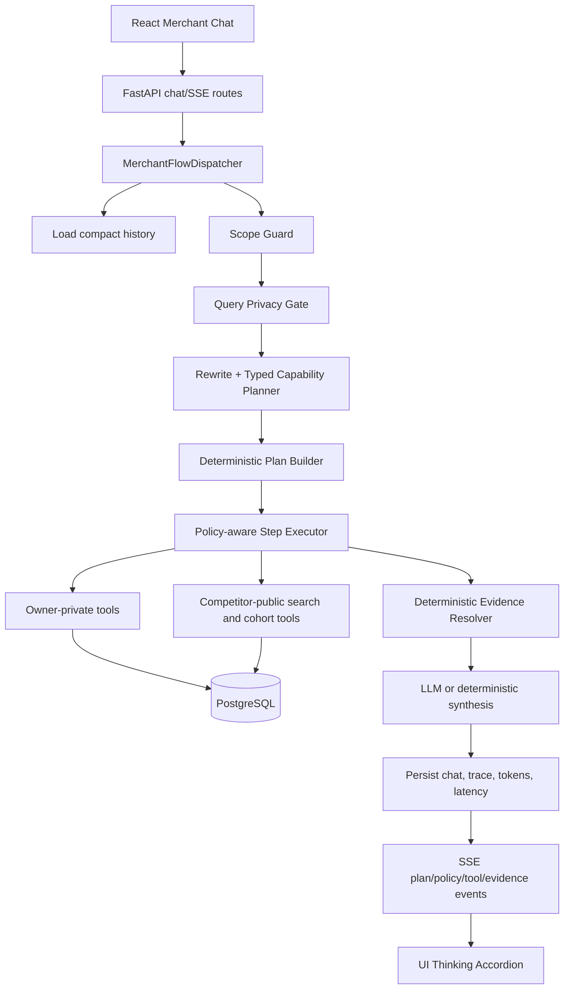
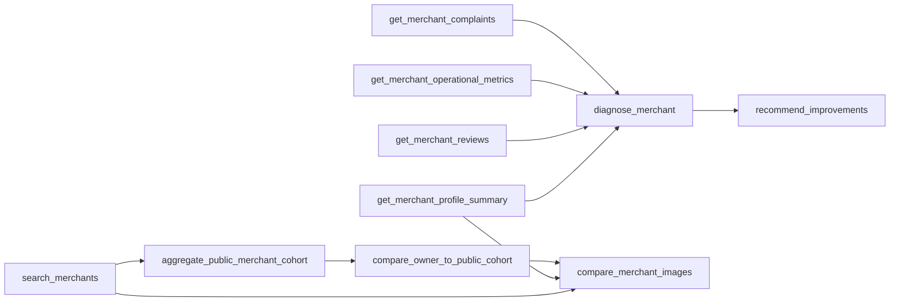

# Merchant Agent — Week 2 Changes and Current Architecture

> Thời điểm hoàn tất: 2026-07-27  
> Trạng thái: implemented và verified  
> Phạm vi: merchant-owner orchestration, retrieval, privacy, evidence,
> observability, evaluation và image comparison

## 1. Mục tiêu Week 2

Week 2 refactor orchestration layer để Merchant Advisor đáp ứng các use case:

1. tìm quán theo cuisine, giá, rating và vị trí;
2. tìm rồi phân tích một cohort bằng dữ liệu công khai;
3. đánh giá quán owner từ profile, metrics, reviews và complaints;
4. giải thích điểm yếu và nguyên nhân có evidence;
5. so sánh owner với cohort tương tự;
6. đề xuất hành động cải thiện;
7. so sánh metadata chất lượng ảnh của owner với ảnh công khai trên marketplace.

HITL chưa được thêm vì không cần thiết cho phạm vi hiện tại. Nguyên tắc kiến
trúc là:

> LLM diễn giải và tổng hợp; Python quyết định dependency, privacy, evidence và
> fallback.

## 2. Thay đổi chính so với Week 1

| Thành phần | Week 1 | Week 2 |
|---|---|---|
| Routing | Một intent duy nhất | Multi-capability typed plan |
| Follow-up | Classify raw message, rewrite riêng | History-aware rewrite trước planning |
| Tool orchestration | Fixed CrewAI crew | Deterministic dependency graph |
| Search | Filter cơ bản | Price range, rating, district, radius, owner-relative search |
| Review | Không có retrieval contract riêng | Owner review aggregation + evidence refs |
| Market analysis | Individual search/benchmark | Public cohort aggregation + provenance |
| Privacy | Prompt, allow-list và tool convention | Query gate + owner binding + public projection |
| Evidence | Shape guardrail + LLM verifier | Deterministic reference/number/policy resolver |
| Streaming | NLU logic có thể chạy lặp | Một chat run phát cả events và final answer |
| Token usage | Chủ yếu Crew kickoff | Planner + synthesis usage |
| Evaluation | Chưa có golden set | 34 owner-approved cases + Ragas |
| Images | Menu/image retrieval | Owner vs public cohort metadata comparison |

## 3. Kiến trúc hiện hành



Mỗi run có immutable context:

```python
MerchantExecutionContext(
    trace_id=...,
    session_id=...,
    user_id=...,
    owner_merchant_id=...,
)
```

Mọi owner-private tool lấy merchant target từ context. Planner hoặc LLM không
được đổi target sang một merchant khác.

## 4. Typed multi-capability planner

### 4.1 Capability model

Một query có thể chứa nhiều capability:

| Capability | Trách nhiệm |
|---|---|
| `restaurant_search` | Tìm merchant theo filter |
| `market_cohort_analysis` | Tổng hợp cohort công khai |
| `owner_profile_analysis` | Profile và operational metrics của owner |
| `owner_review_analysis` | Review themes và complaints của owner |
| `owner_diagnosis` | Điểm yếu và nguyên nhân |
| `owner_vs_market_benchmark` | Owner so với public cohort |
| `recommendation` | Hành động cải thiện |
| `image_comparison` | Owner images so với public images |
| `general_chat` | Không cần data tools |

`CapabilityPlan` tự normalize dependency. Ví dụ benchmark luôn cần search và
cohort; recommendation cần owner diagnosis; image comparison cần search,
cohort, owner profile và benchmark.

### 4.2 Rewrite và history

Planner áp dụng các rule:

- query standalone không bị LLM rewrite để tránh tự thêm intent;
- follow-up có đại từ như “nhóm đó”, “còn … thì sao?”, “vậy làm gì trước?”
  được neo bằng user turn gần nhất;
- query đã rewrite mới được đưa vào capability planner;
- planner JSON được validate bằng Pydantic và retry một lần;
- output lỗi thì dùng deterministic fallback;
- filter literal có confidence cao được parser deterministic giữ lại sau LLM:
  city, district, cuisine, price range, rating và radius.

Việc merge deterministic filter ngăn model dịch `chay` thành một giá trị không
khớp dữ liệu hoặc làm mất `Huế / bún bò / dưới 70k` trong follow-up.

### 4.3 Search filters

```text
query
city
district
cuisine
category
price_level
min_menu_price
max_menu_price
min_rating
radius_km
use_owner_location
limit
```

Search trả thêm thống kê giá menu và có thể sắp xếp theo relevance, rating
hoặc distance.

## 5. Deterministic execution graph

Plan builder chuyển capability thành các step có dependency. Step trùng chỉ
chạy một lần và output được tái sử dụng.



### Capability-to-tool mapping

| Capability | Tool sequence |
|---|---|
| Search | `search_merchants` |
| Cohort | Search → `aggregate_public_merchant_cohort` |
| Owner profile | `get_merchant_profile_summary` + operational metrics |
| Owner reviews | `get_merchant_reviews` + complaints |
| Diagnosis | Profile + reviews + metrics + complaints → `diagnose_merchant` |
| Benchmark | Search → cohort → `compare_owner_to_public_cohort` |
| Recommendation | Verified diagnosis → `recommend_improvements` |
| Image comparison | Search + owner profile + benchmark → `compare_merchant_images` |

Image-only weakness analysis không chạy full review/complaint diagnosis nếu user
không hỏi review. Image comparison tool tự cung cấp quality/blur gap.

## 6. Review retrieval và public cohort

### 6.1 Owner review retrieval

`get_merchant_reviews` trả:

- tổng số review;
- sentiment counts;
- rating distribution;
- deterministic themes;
- bounded review samples;
- `review:<review_id>` evidence refs.

Tool chỉ chạy trong owner-private context.

### 6.2 Public cohort aggregation

`aggregate_public_merchant_cohort` nhận candidate IDs từ search và chỉ trả:

- cohort definition và merchant count;
- platform rating statistics;
- menu price statistics;
- public profile dimensions;
- review sentiment/theme aggregates;
- image quality/blur aggregates;
- provenance và `aggregate:<step>:<field>` refs.

Nó không trả operational metrics, order volume, complaints, delivery feedback,
diagnosis hoặc recommendation của từng competitor.

### 6.3 Owner-to-cohort benchmark

`compare_owner_to_public_cohort` so owner với mean/median của cohort trên bốn
dimension công khai:

- `food_quality`;
- `image_quality`;
- `menu_diversity`;
- `price_competitiveness`.

Output gồm owner value, cohort mean/median, delta và evidence refs. Hệ thống
không suy ngược KPI riêng của từng competitor.

## 7. Public/private policy

`MerchantDataPolicy` là code gate, không phải prompt.

### 7.1 Query-level denial

Nếu query yêu cầu KPI riêng của competitor như doanh thu, số đơn, cancel rate,
prep time, on-time rate hoặc complaints nội bộ:

```text
request
  -> policy_decision: denied
  -> không chạy planner
  -> không gọi data tool
  -> trả lời rằng chỉ có thể dùng dữ liệu công khai
```

Policy denial vẫn có trace nhưng token usage bằng 0.

### 7.2 Owner binding

Mọi owner-private step gọi:

```python
policy.assert_owner_target(context.owner_merchant_id)
```

Target khác owner của run bị từ chối.

### 7.3 Competitor public projection

Competitor record được project qua allow-list field. Chỉ identity, vị trí,
cuisine/category, public rating/reviews, menu price, public image metadata và
bốn public dimensions được phép đi vào cohort hoặc synthesis.

## 8. Deterministic evidence resolver

LLM Evidence Verifier không còn là correctness/security gate. Thay vào đó,
`EvidenceValidationService` resolve các reference:

```text
review:<id>
complaint:<id>
metric:<merchant_id>:<field>
profile:<merchant_id>:<dimension>
image:<id>
aggregate:<step_id>:<field.path>
```

Mỗi claim bị loại nếu:

- evidence không tồn tại;
- evidence là private data của competitor;
- public profile dimension không nằm trong allow-list;
- cited number không khớp source value.

Chỉ `valid_claims` và verified structured outputs được chuyển sang synthesis.
Nếu không có claim hợp lệ, status là `insufficient_data`; hệ thống không bịa
nguyên nhân để lấp khoảng trống.

## 9. Image comparison

`compare_merchant_images` là flow deterministic dựa trên metadata hiện có,
không tải pixel và không gọi vision model.

Tool:

- lấy owner image quality và blur scores;
- lấy ảnh công khai của cohort;
- loại owner khỏi competitor IDs;
- tính mean quality/blur;
- chọn bounded owner samples và public reference samples;
- trả quality delta, blur delta, URL công khai và evidence refs;
- không đọc KPI hoặc complaints của competitor.

Đây là mức triển khai phù hợp demo hiện tại. So sánh composition, lighting,
food styling hoặc semantic similarity từ pixels là phase sau.

## 10. Synthesis và fallback

Synthesis agent không có tool. Nó nhận:

- structured tool outputs;
- verified claims;
- rejected claim count;
- rewritten query và history.

Khi LLM không cấu hình hoặc synthesis lỗi, `_deterministic_synthesis` render
các section:

- Kết quả tìm kiếm;
- Phân tích nhóm quán;
- Chất lượng quán của bạn;
- Review của quán;
- Điểm yếu và nguyên nhân;
- So sánh quán với cohort công khai;
- So sánh hình ảnh món ăn;
- Hành động đề xuất.

Nhờ vậy offline eval và demo fallback vẫn chạy trên dữ liệu thật, không cần
mock final answer.

## 11. Single-run SSE và UI observability

`chat_stream()` tạo một worker gọi đúng một `chat()` run. Chính run đó phát
events và tạo final answer:

```text
plan
policy_decision
agent_start
tool_call
tool_result
evidence_validation
agent_retry | agent_error
execution_finish
```

`execution_finish` trả:

- `trace_id`;
- capabilities;
- rewritten query;
- evidence status;
- prompt/completion/total tokens;
- latency;
- merchant results.

Frontend `AgentThinkingAccordion` hiển thị:

- capability chips;
- query sau rewrite;
- policy decisions;
- agent/tool timeline;
- merchant chips từ tool result;
- evidence status;
- prompt, completion và total tokens;
- latency và trace ID.

Token usage là tổng planner usage và synthesis usage. Tool execution không dùng
LLM nên không phát sinh LLM token.

## 12. Golden dataset và Ragas evaluation

Dataset đã được merchant owner duyệt:

```text
evals/merchant/golden_dataset.jsonl
evals/merchant/metadata.json
```

Mỗi case có:

```yaml
question: ...
history: ...
expected_agent: ...
expected_tools: ...
expected_content: ...
tags: ...
```

34 cases bao phủ search, price, location, cohort, owner profile, reviews,
complaints, diagnosis, recommendation, benchmark, paraphrase, follow-up,
compound query, privacy và image comparison.

Evaluator:

- dùng Ragas `ToolCallAccuracy` và `ToolCallF1`;
- dùng set F1 cho capability plan;
- dùng content coverage cho required content;
- lưu trace ID, token usage, latency, status và error theo case;
- không tính case runtime error như một kết quả 0 điểm hợp lệ;
- trả exit code khác 0 nếu có case lỗi;
- từ chối baseline nếu metadata chưa được owner review.

### Kết quả

| Run | Agent F1 | Tool F1 | Content coverage | Thành công |
|---|---:|---:|---:|---:|
| Baseline offline | 0.7241 | 0.6677 | 0.6176 | 34/34 |
| Final offline | 1.0000 | 1.0000 | 1.0000 | 34/34 |

Evaluator sinh report JSON và Markdown vào
`evals/merchant/results/<run-name>/`. Thư mục `results/` là runtime artifact và
có thể được dọn sau khi review; bảng trên là snapshot của lần verification cuối
trước khi tổng hợp tài liệu này.

Offline run đặt `LLM_API_KEY` rỗng, nên token count bằng 0 và chỉ đánh giá
deterministic planner/tool/policy/evidence/synthesis path. Full-data live LLM
eval không được chạy vì endpoint LLM chưa được phê duyệt rõ ràng để nhận
profile/review/complaint của merchant.

Planner-only live smoke dùng ba câu synthetic, không đọc database:

- simple search: đúng;
- compound search/cohort/benchmark: đúng;
- history follow-up: giữ đúng cuisine, city và budget.

## 13. Verification

Các kiểm tra cuối:

| Thành phần | Kết quả |
|---|---|
| Backend | 147 tests pass trong conda env `ocr` |
| Frontend | 13 tests pass |
| Frontend production build | Pass |
| Golden dataset | 34 cases, `reviewed=true` |
| Final offline evaluation | 34/34, mọi metric 1.0000 |
| `git diff --check` | Pass |

Không có commit được tạo trong quá trình refactor.

## 14. Cách chạy evaluation

```bash
conda run -n ocr python scripts/eval/run_merchant_eval.py validate

conda run -n ocr python scripts/eval/run_merchant_eval.py preview

env LLM_API_KEY= conda run -n ocr \
  python scripts/eval/run_merchant_eval.py run \
  --output-dir evals/merchant/results/local-offline
```

Live full-data eval chỉ nên chạy sau khi xác nhận endpoint và policy cho phép
gửi dữ liệu merchant cần thiết tới endpoint đó.

## 15. Thành phần chính của kiến trúc Week 2

```text
backend/models/merchant_orchestration.py
backend/services/merchant_query_planner.py
backend/services/merchant_plan_executor.py
backend/services/merchant_data_policy.py
backend/services/evidence_validation_service.py
backend/repositories/evidence_repository.py
backend/tools/merchant/search_tool.py
backend/tools/merchant/reviews_tool.py
backend/tools/merchant/cohort_tool.py
backend/tools/merchant/image_comparison_tool.py
backend/flows/merchant_flow.py
backend/evaluation/merchant_eval.py
scripts/eval/run_merchant_eval.py
evals/merchant/
frontend/src/merchant/hooks/useMerchantChat.ts
frontend/src/merchant/components/chat/AgentThinkingAccordion.tsx
```

Kiến trúc Week 1 được lưu tại
[`MERCHANT_AGENT_WEEK_1.md`](./MERCHANT_AGENT_WEEK_1.md).

## 16. Giới hạn còn lại

- Image comparison hiện dùng metadata, chưa phân tích pixels.
- Live end-to-end Ragas run với private owner context cần explicit data-sharing
  approval.
- Fallback keyword parser hỗ trợ các pattern tiếng Việt phổ biến, chưa phải NLU
  tổng quát cho mọi cách diễn đạt.
- Authentication phải bind user-to-owner merchant trước khi dùng production;
  demo hiện coi merchant ID được chọn là owner context.
- Semantic quality của câu trả lời LLM vẫn cần được theo dõi ngoài deterministic
  evidence correctness.
