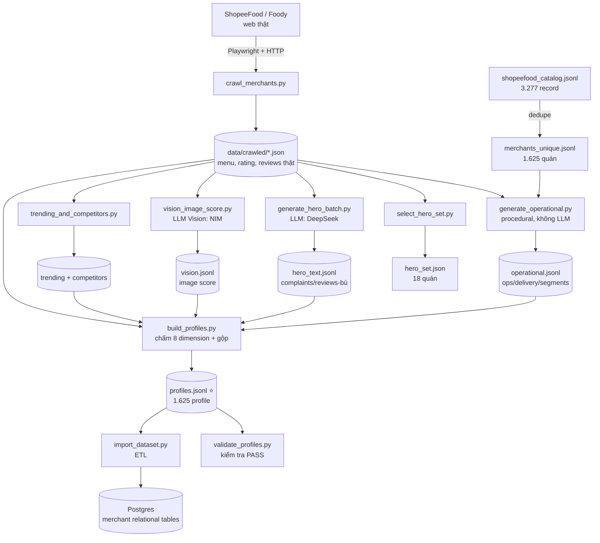

# Dữ liệu: Pipeline & Từ điển — AI Restaurant

Tài liệu DUY NHẤT về dữ liệu: (1) **luồng pipeline** tạo ra dữ liệu (từng bước), và (2) **từ điển** mô tả dữ liệu cuối. **Đọc file này thay vì lục thư mục `data/`.** Schema DB xem [`database-schema.md`](./database-schema.md); công thức chấm điểm xem [`scoring-methodology.md`](./scoring-methodology.md).

## Nguồn sự thật (source of truth)
➡️ **`data/profiles.jsonl`** — input snapshot, mỗi dòng là 1 Merchant Profile hợp nhất (**1.625 dòng**). Importer phân rã snapshot này thành các bảng typed relational; runtime Agent đọc qua repository, không đọc JSON profile trực tiếp.

---

# PHẦN 1 — LUỒNG PIPELINE

Dữ liệu chảy **một chiều**: nguồn thô → làm giàu → Merchant Profile → Postgres. Mỗi bước là 1 script độc lập, chạy lại được.

## Sơ đồ tổng quan


## Chi tiết từng bước

### Bước 1 — Dedupe catalog  `crawl/dedupe_catalog.py`
- **Input:** `shopeefood_catalog.jsonl` (3.277 record thô, có bản trùng network + DOM).
- **Làm gì:** gộp bản trùng theo `source_url`; ưu tiên record có ID số; loại tên lỗi/rác.
- **Output:** `merchants_unique.jsonl` — 1.625 quán unique (có ID số).

### Bước 2 — Crawl dữ liệu thật  `crawl/crawl_merchants.py`
- **Input:** danh sách quán từ Bước 1.
- **Làm gì:** dùng **Playwright** (trình duyệt thật) mở trang ShopeeFood → trang tự bắn XHR có chữ ký hợp lệ → bắt response thụ động (`get_detail`, `get_delivery_dishes`) lấy **menu + rating**. Reviews không có trên ShopeeFood → lấy từ trang **Foody** (cùng slug), parse HTML bằng regex.
- **Vì sao phức tạp:** ShopeeFood chặn `curl` bằng chữ ký `x-sap-ri` + header ngẫu nhiên → không gọi API trực tiếp được, phải để trình duyệt thật tự ký.
- **Output:** `crawled/{id}.json`. Coverage: **menu 99%, rating 99%, reviews thật ~40%** (Foody thưa).

### Bước 3 — Cấu hình kịch bản quán yếu  `synth/scenarios.py`
- **Làm gì:** khai báo 5 kịch bản điểm yếu + gán 5 hero merchant (nguồn gán DUY NHẤT `SCENARIO_ASSIGN`, dùng chung cho các bước sau → DRY). Không sinh dữ liệu, chỉ là config.
- Chi tiết ở [mục "Kịch bản quán yếu"](#kịch-bản-quán-yếu-có-chủ-đích) bên dưới.

### Bước 4 — Synthetic số (ops metrics)  `synth/generate_operational.py`
- **Input:** crawled + catalog.
- **Làm gì:** công thức **xác định** (seed = `merchant_id`, nên tái lập được) suy ra ops/delivery/segments từ rating + category. Tương quan thật: rating cao → cancel_rate thấp, on_time/driver cao. Peak hours theo category, segments theo giá + taste_tags. Với 5 quán kịch bản *ops-driven*: ép số vận hành xấu qua `apply_ops_override`.
- **Output:** `synthetic/operational.jsonl` (1.625). Có field `scenario` cho 5 quán yếu.

### Bước 5 — Chọn hero-set  `synth/select_hero_set.py`
- **Input:** crawled.
- **Làm gì:** lọc quán ≥5 review & ≥10 món; chọn cụm đối thủ (3–5 quán cùng cuisine/khu vực) + rating-spread + phủ 9 thành phố; gán 5 quán → kịch bản yếu.
- **Output:** `synthetic/hero_set.json` (18 quán + lý do `why` + `scenario`).

### Bước 6 — Synthetic text (LLM)  `synth/generate_hero_batch.py`  *(cần `.env` LLM)*
- **Input:** 18 hero + menu/reviews thật của quán.
- **Làm gì:** prompt nhồi dữ liệu thật → **DeepSeek** sinh `complaints` + `delivery_feedback` + review-bù (`filled_reviews` cho đủ 8 nếu review thật <8). Complaint bám tín hiệu yếu (on_time thấp → nhiều complaint giao trễ). Với 5 quán kịch bản *rating-anchored*: nhồi chỉ thị `prompt_directive` ép complaint tập trung + review điểm thấp.
- **Chọn DeepSeek** sau khi so 3 model (nhanh nhất, tuân luật). `/no_think` + max_tokens cao cho model reasoning.
- **Output:** `synthetic/hero_text.jsonl`.

### Bước 7 — Vision chấm ảnh  `profile/vision_image_score.py`  *(cần NIM vision)*
- **Input:** ảnh món 18 hero.
- **Làm gì:** LLM Vision (NIM Qwen) chấm chất lượng ảnh 0–1 + notes.
- **Output:** `profile_cache/vision.jsonl`. Background không chấm → dùng heuristic phủ ảnh.

### Bước 8 — Precompute trending & competitors  `profile/trending_and_competitors.py`
- **Input:** crawled + catalog.
- **Làm gì:** **trending** theo cụm `city||cuisine` (tần suất + like món); **competitors** theo haversine cùng cuisine ≤8km.
- **Output:** `profile_cache/{trending_by_cluster.json, competitors_by_merchant.json}`.

### Bước 9 — Scoring + gộp  `profile/build_profiles.py`  ⭐
- **Input:** TẤT CẢ các bước trên.
- **Làm gì:** chấm **8 dimension** (mỗi cái `score 0–1 + evidence + basis`), ráp **5 attribute**, hợp nhất thành 1 profile/quán tự chứa đủ. Hero dùng reviews/complaints/vision thật+synthetic; background dùng rating proxy + ops procedural. `overall_score` = trung bình 8 dimension. Công thức đầy đủ: [`scoring-methodology.md`](./scoring-methodology.md).
- **Output:** `profiles.jsonl` (1.625) — file lõi.

### Bước 10 — Validate  `profile/validate_profiles.py`
- **Làm gì:** kiểm trường/range/evidence/referential integrity.
- **Output:** báo cáo PASS (`data/profiles_validation_report.json`).

### Bước 11 — Import Postgres  `db/import_dataset.py`  *(cần Postgres)*
- **Làm gì:** map profiles + crawled → typed merchant tables. `tier hero → is_demo_target=true`; review `score → sentiment` (≥7 pos, <5 neg); 8 scores → `merchant_profiles` columns; operational/rating facts → dedicated tables; evidence → `merchant_dimension_evidence`; delivery `on_time → rating 1–5`. Idempotent (TRUNCATE + insert).
- **Output:** Postgres ~**208k row**. Chi tiết bảng: [`database-schema.md`](./database-schema.md).

## Kịch bản quán yếu có chủ đích
Để demo Diagnosis/Recommendation/Competitor có điểm yếu rõ ràng, gán **5 hero → 5 kịch bản**, mỗi kịch bản làm yếu **1 dimension khác nhau**:

| Merchant | Kịch bản | Dimension yếu | Cơ chế |
|---|---|---|---|
| 10344 | `weak_delivery` | delivery_quality | ops-driven (on_time thấp) + complaints trễ |
| 68814 | `weak_service` | service | rating-anchored (complaints thái độ) |
| 100810 | `weak_packaging` | packaging | ops-driven (packaging_ok thấp) + complaints |
| 13909 | `weak_food` | food_quality | rating-anchored (complaints chất lượng + review thấp) |
| 233150 | `slow_prep` | waiting_time | ops-driven (avg_prep cao) |

**2 cơ chế:** (a) *ops-driven* — ép số vận hành xấu ở Bước 4 (`apply_ops_override`); (b) *rating-anchored* — làm yếu qua complaints tập trung + review điểm thấp ở Bước 6 (`prompt_directive`). Vì scoring trừ điểm đúng category complaint nên điểm yếu **tất định, tái lập**. Kết quả kiểm chứng: cả 5 quán lộ đúng dimension mục tiêu (xem `scoring-methodology.md` Decision log).

## Chạy lại toàn bộ (đúng thứ tự)
```bash
python scripts/crawl/dedupe_catalog.py
python scripts/crawl/crawl_merchants.py            # Playwright + Foody (lâu)
python scripts/synth/generate_operational.py
python scripts/synth/select_hero_set.py
PYTHONPATH=scripts/synth python scripts/synth/generate_hero_batch.py   # cần .env LLM
python scripts/profile/vision_image_score.py       # cần NIM vision
python scripts/profile/trending_and_competitors.py
PYTHONPATH=scripts/profile python scripts/profile/build_profiles.py
python scripts/profile/validate_profiles.py
cd backend && python ../scripts/db/import_dataset.py   # cần Postgres
```
> **Rebuild rẻ:** Bước 4,8,9,10 (procedural + scoring) chạy lại tức thì, miễn phí. Phần đắt/chậm là crawl (Bước 2) + LLM (Bước 6,7). **Snapshot:** crawler *skip quán đã có* → chưa auto lấy review mới (cần cờ `--refresh`, ngoài phạm vi demo). **Idempotent:** dedupe/build/import chạy lại cho kết quả nhất quán.

---

# PHẦN 2 — TỪ ĐIỂN DỮ LIỆU

## Cấu trúc mỗi dòng `profiles.jsonl`
| Trường | Ý nghĩa |
|---|---|
| `merchant_id` | ID ShopeeFood (số) |
| `tier` | `hero` (18, dữ liệu sâu) hoặc `background` (1.607, nhẹ) |
| `overall_score` | Trung bình 8 dimension (0–1), generated internally as `overall_score_internal`. ⚠️ **Không show ra ngoài** |
| `metadata` | name, cuisine, category, location{address,lat,lng,city}, open_hours, image_url, source_url, phones, taste_tags, diet_tags |
| `price_level` | nhãn: rẻ / trung bình / cao cấp; score dimension lưu ở `price_competitiveness_score` |
| `dimensions` | 8 scored dimension, mỗi cái `{score 0-1, evidence[], basis}` |
| `attributes` | customer_segments, peak_time, competitors[], trending_dishes[], operation_kpis, delivery_stats |
| `ratings` | shopeefood_avg (0-5), shopeefood_total_review, foody_rating (0-10), foody_review_count |
| `menu` | list món: name, type, price, discount_price, total_like, has_photo (ảnh đầy đủ ở `crawled/`) |
| `reviews` | review THẬT (Foody): text + score/10 |
| `synthetic_reviews` | review bù LLM (chỉ hero thiếu <8 review) |
| `complaints` | khiếu nại synthetic (hero): category, text, severity, date |
| `delivery_feedback` | phản hồi tài xế synthetic (hero) |
| `data_sources` | ghi rõ nguồn từng nhóm dữ liệu (thật/synthetic/vision/heuristic) |

## 8 Scored Dimensions (score 0–1 + evidence)
| Dimension | Cách tính (tóm tắt) | Evidence chính |
|---|---|---|
| food_quality | rating + sentiment review + độ phổ biến món − complaint | positive/negative_review_count, top_dish_avg_likes |
| image_quality | Vision LLM (hero) HOẶC heuristic phủ ảnh HD | vision_score / dishes_with_hd_photo |
| delivery_quality | on_time_rate + driver_rating + thời gian giao − complaint trễ | on_time_rate, avg_delivery_minutes |
| packaging | packaging_ok_rate − complaint đóng gói | packaging_ok_rate, packaging_complaint_count |
| service | rating − complaint thái độ | service_complaint_count |
| waiting_time | thời gian chuẩn bị (thấp→điểm cao) − complaint trễ | avg_prep_minutes |
| menu_diversity | số món + số nhóm món | dish_count, dish_type_count |
| price_competitiveness | giá vs median CÙNG cuisine; ngang/rẻ hơn peers→1.0, chỉ ĐẮT hơn mới giảm | peer_median_price, price_ratio_vs_peers |

> Công thức đầy đủ (trọng số, hệ số): [`scoring-methodology.md`](./scoring-methodology.md). **Nguyên tắc:** mọi score kèm evidence số liệu truy vết được.

## 5 Attributes (mô tả, không chấm điểm)
customer_segments · peak_time · competitors (id+name+dist_km, cùng cuisine ≤8km) · trending_dishes (theo cụm city+cuisine) · operation_kpis + delivery_stats.

## Schema từng entity + số lượng theo tầng (as-built)
Đặc tả **dữ liệu THỰC TẾ đang có**. Mô hình 2 tầng: `hero` (18, sâu) vs `background` (1.607, nhẹ). Phần lớn là dữ liệu THẬT (crawl); chỉ complaints / delivery_feedback / filled_reviews là synthetic và **chỉ có ở hero**.

### A. Số lượng mẫu mỗi merchant
| Entity | Hero (18) | Background (1.607) | Nguồn |
|---|---|---|---|
| `reviews` (thật, Foody) | 6–10 (median 10) | 0–10 (median 0; **971 quán = 0**, 636 quán ≥1) | crawl |
| `synthetic_reviews` (bù) | 0–3 (median 0) — chỉ bù *tới* 8 khi review thật <8 | 0 | LLM |
| `complaints` | 7–8 | 0 | LLM |
| `delivery_feedback` | 5 | 0 | LLM |
| vision image score | 1/quán | 0 (dùng heuristic phủ ảnh) | Vision LLM |
| `operation_kpis` + `delivery_stats` | đầy đủ | đầy đủ | procedural |
| `menu` (nhóm món / dish_type) | 14–160 nhóm (median 76) | 0–616 nhóm (median 52) | crawl |

> ⚠️ `menu` đếm theo **nhóm món (dish_type)**, không phải số món lẻ. "Ảnh" KHÔNG phải entity seed được: chỉ có `has_photo` bool mỗi món (thật) + 1 vision score/hero.

### B. Schema chi tiết từng entity
**`complaints[]`** (hero, synthetic):
| Field | Type | Nullable | Ghi chú |
|---|---|---|---|
| `category` | enum(8) | không | `giao_hàng_trễ` · `món_nguội` · `sai_hoặc_thiếu_món` · `đóng_gói_kém` · `thái_độ_phục_vụ` · `giá_cao` · `vệ_sinh` · `chất_lượng_món` |
| `text` | string | không | tiếng Việt tự nhiên, nhắc tên món thật khi hợp lý |
| `severity` | enum(3) | không | `low` / `medium` / `high` |
| `date` | string(YYYY-MM-DD) | không | 2026 gần đây |

**`reviews[]`** (thật) & **`synthetic_reviews[]`** (bù):
| Field | Type | Nullable | Ghi chú |
|---|---|---|---|
| `text` | string | không | nội dung review |
| `score` | number(0–10) | không | thang 10, nhất quán rating thật |

**`delivery_feedback[]`** (hero, synthetic):
| Field | Type | Nullable | Ghi chú |
|---|---|---|---|
| `text` | string | không | phản hồi ngắn |
| `on_time` | bool | không | giao đúng giờ hay không |
| `issue` | string | **có** (null nếu không sự cố) | mô tả sự cố ngắn |

**ops metrics** — `attributes.operation_kpis` + `attributes.delivery_stats` (procedural, mọi merchant):
| Field | Type | Nhóm | → Dimension |
|---|---|---|---|
| `avg_prep_minutes` | int | operation_kpis | waiting_time |
| `cancel_rate` | float(0–1) | operation_kpis | — |
| `acceptance_rate` | float(0–1) | operation_kpis | — |
| `estimated_daily_orders` | int | operation_kpis | — |
| `peak_hours` | string[] | operation_kpis | (attribute peak_time) |
| `avg_delivery_minutes` | int | delivery_stats | delivery_quality |
| `on_time_rate` | float(0–1) | delivery_stats | delivery_quality |
| `driver_rating` | float(0–5) | delivery_stats | delivery_quality |
| `packaging_ok_rate` | float(0–1) | delivery_stats | packaging |

**image** — cấp món: `menu[].has_photo` (bool); vision (hero): `vision_score` (0–1) + `notes`.

### C. Map complaint category → dimension bị trừ điểm
`giao_hàng_trễ` → **delivery_quality** (& `waiting_time`, *sẽ bỏ ở waiting_time — xem scoring Decision log*) · `đóng_gói_kém` → **packaging** · `thái_độ_phục_vụ` → **service** · `chất_lượng_món` + `món_nguội` → **food_quality**.

## Sơ đồ thư mục `data/`
```
data/
├── shopeefood_catalog.jsonl        # [SOURCE, tracked] 3.277 record gốc crawl (raw)
├── merchants_unique.jsonl          # [gitignored] 1.681 quán unique sau dedupe (1.625 có id số)
├── crawled/{id}.json               # [gitignored, 523MB] crawl thô: menu+rating+reviews
├── synthetic/
│   ├── operational.jsonl           # ops metrics + delivery + segments (procedural, 1.625); field `scenario`
│   ├── hero_set.json               # 18 hero + lý do `why` + `scenario` (5 quán demo)
│   ├── hero_text.jsonl             # complaints + delivery_feedback + filled_reviews (LLM, 18 hero)
│   └── model_comparison.jsonl      # so sánh 3 model LLM (tham khảo QA)
├── profile_cache/
│   ├── trending_by_cluster.json    # trending theo "city||cuisine"
│   ├── competitors_by_merchant.json# đối thủ gần nhất theo merchant
│   └── vision.jsonl                # image score Vision LLM (18 hero)
└── profiles.jsonl                  # ⭐ MERCHANT PROFILE HỢP NHẤT (1.625 dòng) — đọc CÁI NÀY
data/profiles_validation_report.json # báo cáo kiểm tra
```

## Ghi chú
- Rating cũ trong catalog (`merchant_rating`) là RÁC (đã bỏ) — dùng `ratings.shopeefood_avg` thật.
- `shopeefood_total_review` chặn ở 1000 ("999+") — số chính xác thấp dùng `foody_review_count`.
- 9 quán menu rỗng = đã đóng/gỡ khỏi ShopeeFood (rating=0).
- Reviews thật chỉ ~40% quán (Foody thưa) — background thiếu review dùng rating proxy cho food_quality.
