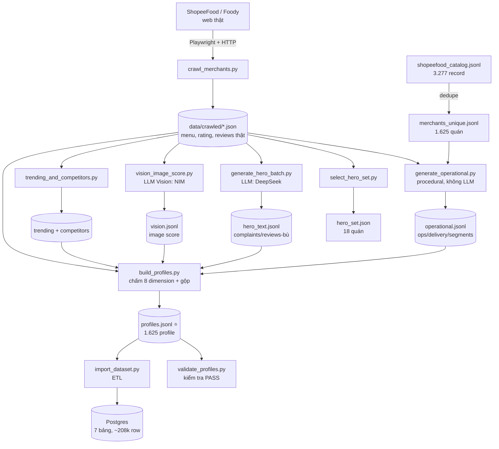

# Data Processing Pipeline

Luồng xử lý dữ liệu end-to-end: từ nguồn thô → Merchant Profile → Postgres. Chi tiết field xem [`data-dictionary.md`](./data-dictionary.md).

## Sơ đồ tổng quan



## Các tầng xử lý

| # | Tầng | Input | Xử lý (transformation) | Output | Script |
|---|---|---|---|---|---|
| 1 | **Dedupe** | catalog 3.277 record | Gộp bản network+DOM theo `source_url`, ưu tiên ID số, loại tên lỗi | 1.625 quán unique | `crawl/dedupe_catalog.py` |
| 2 | **Crawl** | danh sách quán | Playwright bắt XHR ShopeeFood (vượt anti-bot) lấy menu+rating; parse HTML Foody lấy reviews | `crawled/*.json` | `crawl/crawl_merchants.py` |
| 3 | **Synthetic số** | crawled + catalog | Công thức xác định (seed=merchant_id) suy ops/delivery từ rating+category; ép ops xấu cho 5 quán kịch bản (ops-driven) | `operational.jsonl` | `synth/generate_operational.py` |
| 4 | **Hero select** | crawled | Lọc quán ≥5 review & ≥10 món; chọn cụm đối thủ + rating-spread + phủ 9 tp; gán 5 quán → kịch bản yếu | `hero_set.json` (18) | `synth/select_hero_set.py` |
| 5 | **Synthetic text** | hero + menu/reviews thật | LLM (DeepSeek) sinh complaints/delivery/review-bù bám dimension yếu; nhồi chỉ thị kịch bản cho 5 quán demo | `hero_text.jsonl` | `synth/generate_hero_batch.py` |
| 6 | **Vision** | ảnh món hero | LLM Vision (NIM Qwen) chấm chất lượng ảnh 0-1 | `vision.jsonl` | `profile/vision_image_score.py` |
| 7 | **Precompute** | crawled + catalog | Trending theo cụm (tần suất+like); competitors theo haversine cùng cuisine ≤8km | `profile_cache/*` | `profile/trending_and_competitors.py` |
| 8 | **Scoring + gộp** | tất cả trên | Chấm 8 dimension (score+evidence), ráp 5 attribute, hợp nhất | `profiles.jsonl` ⭐ | `profile/build_profiles.py` |
| 9 | **Validate** | profiles | Kiểm trường/range/evidence/referential integrity | báo cáo PASS | `profile/validate_profiles.py` |
| 10 | **Import DB** | profiles + crawled | Map → 7 bảng Postgres, truncate + bulk insert | Postgres | `db/import_dataset.py` |

## Chi tiết "xử lý" ở các tầng lõi

**Tầng 2 — Crawl (vượt anti-bot):** ShopeeFood chặn `curl` bằng chữ ký `x-sap-ri` + header ngẫu nhiên. Giải: dùng trình duyệt thật (Playwright) để trang tự bắn XHR có chữ ký → bắt response thụ động (`get_detail`, `get_delivery_dishes`). Reviews không có trên ShopeeFood → lấy từ trang Foody (cùng slug) render sẵn HTML, parse bằng regex. Coverage: menu 99%, rating 99%, reviews thật 40%.

**Tầng 3 — Synthetic số (không LLM):** deterministic theo `seed=merchant_id` nên tái lập được. Tương quan với rating thật: rating cao → cancel_rate thấp, on_time_rate/driver_rating cao. Peak hours theo category. Segments theo giá+taste_tags.

**Tầng 5 — Synthetic text (LLM):** prompt nhồi dữ liệu thật của quán (menu, reviews, ops yếu) → model sinh complaints bám tín hiệu yếu (on_time thấp → nhiều complaint giao trễ). Chọn DeepSeek sau khi so 3 model (nhanh nhất, tuân thủ luật). `/no_think` + max_tokens cao để xử lý model reasoning.

**Kịch bản quán yếu có chủ đích (`synth/scenarios.py`):** để demo Diagnosis/Recommendation/Competitor có điểm yếu rõ ràng, gán 5 hero merchant → 5 kịch bản, MỖI kịch bản làm yếu 1 dimension KHÁC nhau: `weak_delivery`, `weak_service`, `weak_packaging`, `weak_food`, `slow_prep`. Nguồn gán duy nhất là `SCENARIO_ASSIGN` (DRY), dùng chung bởi cả 3 script. Cơ chế 2 lớp: (a) *ops-driven* (delivery/packaging/prep) ép số vận hành xấu ở tầng 3 qua `apply_ops_override`; (b) *rating-anchored* (service/food) làm yếu qua complaints tập trung + review điểm thấp ở tầng 5 qua `prompt_directive`. Vì `dimension_scoring.py` chấm mỗi dimension theo đúng category complaint (`giao_hàng_trễ`→delivery, `đóng_gói_kém`→packaging, `thái_độ_phục_vụ`→service, `chất_lượng_món`/`món_nguội`→food) nên điểm yếu là tất định, tái lập được. Kết quả: cả 5 quán có dimension mục tiêu là điểm yếu vận hành thấp nhất trong profile.

**Tầng 8 — Scoring:** mỗi dimension là hàm thuần trả `(score 0-1, evidence[], basis)`. Hero dùng reviews/complaints/vision thật+synthetic; background dùng rating proxy. Công thức đầy đủ trong `profile/dimension_scoring.py`. overall = trung bình 8 dimension.

**Tầng 10 — Import DB:** map sang schema teammate: `tier hero → is_demo_target=1`, review `score → sentiment` (≥7 positive, <5 negative), `dimensions+attributes+ratings → dimensions_json` (JSONB), delivery `on_time → rating 1-5`. Idempotent (truncate + insert).

## Chạy lại toàn bộ (thứ tự)
```bash
python scripts/crawl/dedupe_catalog.py
python scripts/crawl/crawl_merchants.py            # Playwright + Foody (lâu)
python scripts/synth/generate_operational.py
python scripts/synth/select_hero_set.py
PYTHONPATH=scripts/synth python scripts/synth/generate_hero_batch.py   # cần .env LLM
python scripts/profile/vision_image_score.py       # cần NIM vision
python scripts/profile/trending_and_competitors.py
PYTHONPATH=scripts/profile python scripts/profile/build_profiles.py
python scripts/profile/validate_profiles.py
cd backend && python ../scripts/db/import_dataset.py   # cần Postgres
```

## Đặc điểm & cập nhật
- **Rebuild rẻ:** tầng 3,7,8,9 (procedural + scoring) chạy lại tức thì, miễn phí. Phần đắt/chậm là crawl (tầng 2) + LLM (5,6).
- **Snapshot, chưa auto-update:** crawler hiện *skip quán đã có* → không tự lấy review mới. Muốn cập nhật cần thêm cờ `--refresh` (re-crawl theo tuổi `crawled_at`) rồi rebuild. Xem thảo luận trong lịch sử; chưa triển khai (ngoài phạm vi demo).
- **Idempotent:** dedupe/build/import chạy lại cho kết quả nhất quán, không nhân đôi.
