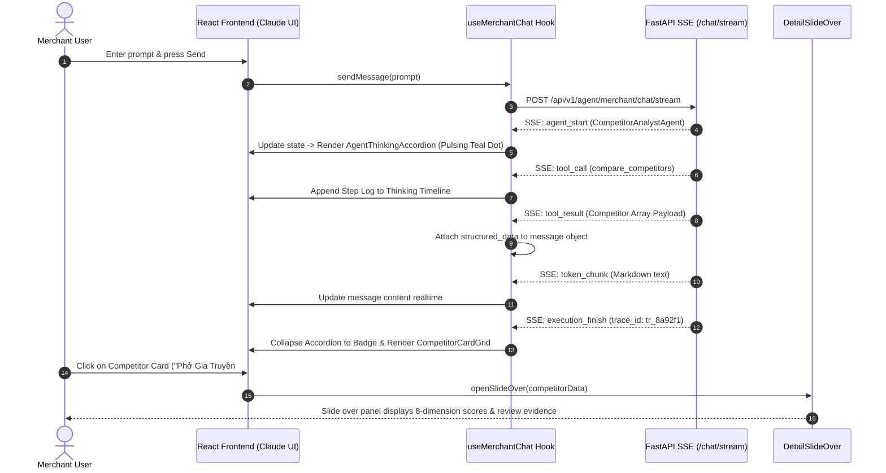

# Technical Design Spec: Merchant Advisor Chatbot UI & Real-Time Agent Telemetry

> **Document Location:** `docs/specs/2026-07-22-chatbot-ui-design.md`  
> **Date:** 2026-07-22  
> **Status:** APPROVED & READY FOR PLANNING  
> **Target Module:** Frontend (`frontend/src/merchant/`) & Backend Streaming Endpoint (`backend/routes/merchant_agent_routes.py`)

---

## 1. Overview & Objectives

This specification details the technical design for the **Merchant Advisor Chatbot UI** within the GSM Merchant Management AI platform. The Chatbot UI serves as the primary conversational interface for merchants to interact with the CrewAI multi-turn reasoning agent.

### Key Goals
1. **Claude Web-Inspired UX & Layout:** Responsive, centered 850px chat window, collapsible left sidebar for sessions & navigation, floating input container, and a right slide-over preview drawer for deep detail inspection.
2. **Strict Design System Compliance (`UI-DESIGN.md`):**
   - **Palette:** Primary Teal (`#28BDBF`), Primary Dark (`#00A398`), Warning/Accent Gold (`#E3BB42`), Light Surface (`#FFFFFF` / `#F9F9FF`), Dark Surface (`#111827` / `#1F2937`), Border (`#E5E7EB` / `#374151`).
   - **Theme:** Full Light/Dark mode support (Default: Light).
   - **Iconography:** Clean SVG vector icons only (Lucide SVG / Material Symbols). No informal emojis.
3. **Real-time Agent Telemetry & Reasoning Checklog:** Server-Sent Events (SSE) streaming from FastAPI + CrewAI showing live agent activation, tool execution timelines, and duration metrics inside an expandable **Thinking Accordion**.
4. **Rich Interactive Component System:**
   - Interactive **Competitor Cards Grid** rendered inline when LLM executes `compare_competitors`.
   - Interactive **Diagnosis & Recommendation Cards** with 2-layer evidence tags.
   - **Right Slide-over Detail Drawer** (Claude Artifacts-style) opening on card click for complete 8-dimension competitor comparisons and full review snippets.

---

## 2. Architecture & Real-Time Data Flow

### 2.1 Backend SSE Endpoint (`FastAPI`)
A new streaming route will be implemented in `backend/routes/merchant_agent_routes.py`:
- **Route:** `POST /api/v1/agent/merchant/chat/stream`
- **Request Body:** `MerchantChatRequest` (`merchant_id`, `message`, `session_id`, `user_id`, `competitor_radius_km`).
- **Response Format:** `text/event-stream` yielding JSON objects:

```json
// Event 1: Agent Activated
event: agent_start
data: {"agent_name": "CompetitorAnalystAgent", "task_description": "Searching nearby competitors in 5km radius", "timestamp": "2026-07-22T16:55:00Z"}

// Event 2: Tool Execution
event: tool_call
data: {"tool_name": "compare_competitors", "args": {"radius_km": 5.0, "limit": 5}}

// Event 3: Tool Execution Finished with Structured Result
event: tool_result
data: {"tool_name": "compare_competitors", "result": {"target_name": "Phở Hà Nội", "competitors": [...]}, "duration_ms": 320}

// Event 4: Content Chunks (Streaming Text)
event: token_chunk
data: {"text": "Dựa trên dữ liệu 5 quán ăn xung quanh..."}

// Event 5: Final Execution Stream Summary
event: execution_finish
data: {"trace_id": "tr_8a92f1", "token_usage": {"total_tokens": 1240, "prompt_tokens": 980, "completion_tokens": 260}, "status": "COMPLETED"}
```

### 2.2 Frontend Stream Consumer Sequence



---

## 3. UI Component Hierarchy & Layout Specifications

### 3.1 Folder & File Structure (`frontend/src/merchant/`)
```
frontend/src/merchant/
├── pages/
│   └── ChatbotPage.tsx            # Main layout wrapper (Sidebar + ChatWindow + SlideOver)
├── components/
│   ├── sidebar/
│   │   ├── SidebarNav.tsx          # Collapsible left navigation drawer
│   │   ├── MerchantSwitcher.tsx    # Merchant ID selection dropdown
│   │   └── SessionHistoryList.tsx  # Chat sessions history grouped by date
│   ├── chat/
│   │   ├── ChatHeader.tsx          # Top bar with active merchant & engine status
│   │   ├── MessageList.tsx         # Centered 850px scrollable message stream
│   │   ├── MessageItem.tsx         # Single message avatar, bubble, markdown renderer
│   │   ├── AgentThinkingAccordion.tsx # Live telemetry, agent steps timeline
│   │   ├── CompetitorCardGrid.tsx  # Grid of interactive competitor cards
│   │   ├── DiagnosisCard.tsx       # Action recommendation card with 2-layer evidence
│   │   └── ChatInput.tsx           # Floating rounded input bar & suggestion chips
│   ├── drawer/
│   │   └── DetailSlideOver.tsx     # Claude-style right slide-over preview panel
│   └── common/
│       ├── ThemeToggle.tsx         # Dark / Light theme switcher button
│       └── SVGIcon.tsx             # Clean SVG vector icon repository
├── hooks/
│   ├── useMerchantChat.ts          # Custom hook for SSE streaming & session state
│   ├── useTheme.ts                 # Theme state hook (Light default / Dark)
│   └── useSlideOver.ts             # Slide-over drawer open/close & item state
└── types/
    └── merchantChat.ts             # TypeScript interfaces for message, telemetry, competitors
```

---

## 4. Component Technical Specifications

### 4.1 `AgentThinkingAccordion.tsx`
- **States:** `isStreaming` (true/false), `isCollapsed` (default: false while streaming, true when completed).
- **Light Theme Colors:** Background `#F9F9FF`, Border `#E5E7EB`, Text `#353535`.
- **Dark Theme Colors:** Background `#1F2937`, Border `#374151`, Text `#FFFFFF`.
- **Streaming Indicator:** Pulse animated circle with Primary Teal `#28BDBF`.
- **Completed Badge:** Clean Checkmark SVG icon + summary text: `Đã hoàn thành suy luận (3 bước • Trace ID: {trace_id} • {total_tokens} tokens)`.

### 4.2 `CompetitorCardGrid.tsx` & `CompetitorCard.tsx`
- **Layout:** 2-column grid on Desktop (≥1024px), 1-column on Mobile (<640px).
- **Styling:** Card background `#FFFFFF` (Dark: `#1F2937`), Border `1px solid #E5E7EB` (Dark: `#374151`), Sharp radius `0px` per `UI-DESIGN.md`.
- **Content:** Name, Distance badge (`1.2 km`), Cuisine tag, Rating score (`8.4/10`).
- **Interaction:** Click anywhere on card -> triggers `openSlideOver(competitor)` to open right slide-over panel.

### 4.3 `DetailSlideOver.tsx` (Claude-Style Right Preview Panel)
- **Position:** `fixed right-0 top-0 bottom-0 z-50`.
- **Width:** `w-full max-w-[450px]` on Desktop, `w-full` on Mobile.
- **Animation:** `transform transition-transform duration-300 ease-in-out` (`translate-x-0` when open, `translate-x-full` when closed).
- **Sections:**
  1. **Header:** Item Title, Category Tag, Close Button (X SVG Icon).
  2. **8-Dimension Metrics Table:** Visual progress bars for score breakdown.
  3. **Customer Review Evidence:** Real quotes & feedback snippets tagged with evidence IDs (`[REV-104]`).
  4. **Action Footer:** Button Primary `#28BDBF` ("Hỏi Agent về đối thủ này").

### 4.4 `SidebarNav.tsx` & Responsive Behavior
- **Breakpoints:**
  - **Desktop (≥1024px):** Persistent 280px sidebar, collapsible with toggle button.
  - **Tablet (640px–1024px):** Icon-only rail (72px) or collapsible overlay.
  - **Mobile (<640px):** Off-canvas slide-out drawer with backdrop overlay.

---

## 5. Theme & Style Token Mapping (`UI-DESIGN.md`)

| Design Token | Light Mode Value | Dark Mode Value | Usage in Chatbot UI |
|---|---|---|---|
| **Primary Action** | `#28BDBF` | `#28BDBF` | Send button, primary CTA, active tab highlight |
| **Primary Dark / Hover** | `#00A398` | `#00A398` | Hover state for buttons and links |
| **Warning / Accent** | `#E3BB42` | `#E3BB42` | Weak dimension badge, warning indicators |
| **Background Surface** | `#FFFFFF` / `#F9F9FF` | `#111827` / `#1F2937` | Main page background, card fill |
| **Text Primary** | `#353535` | `#FFFFFF` | Message copy, heading titles |
| **Text Secondary** | `#666666` | `#9CA3AF` | Telemetry logs, timestamps, subtexts |
| **Border / Divider** | `#E5E7EB` | `#374151` | Card outlines, accordion dividers, sidebar border |

---

## 6. Verification & Self-Review Checklist

- [x] **No hardcoded generic themes:** All colors strictly mapped to `UI-DESIGN.md` design tokens.
- [x] **No casual emoji icons:** All icons specified as SVG vector icons (Lucide / Material Symbols).
- [x] **Theme Switcher:** Supported natively with default `light` mode.
- [x] **Claude UI Reference:** Applied to layout responsiveness, smooth transitions, and right slide-over preview drawer.
- [x] **Real-time Telemetry:** SSE endpoint specified with `agent_start`, `tool_call`, `tool_result`, `token_chunk`, `execution_finish` events.
- [x] **Backend Compatibility:** Interoperable with `merchant_flow.py` and `scripts/merchant_advisor_cli.py`.

---
