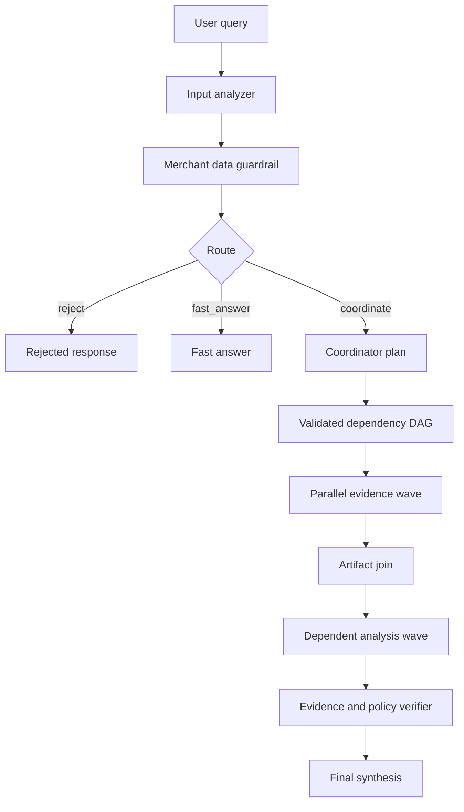

# Technical Design: Merchant Tracing and Policy RAG

> Date: 2026-08-05  
> Status: Approved for phased implementation  
> Scope: Merchant Advisor semantic traces and future Green SM policy retrieval  
> Precedence: Focused delta to `docs/2026-07-21-merchant-ai-agent-complete-design.md`

## 1. Purpose

This document defines one readable trace contract from live execution through
history replay, plus the minimal architecture for a future Green SM Policy RAG
specialist. It does not replace unrelated agent, merchant-data, or API contracts.

The Policy RAG code currently present in the repository is preliminary
scaffolding, not a completed ingestion and retrieval pipeline. No policy facts
may be inferred from the presence of schemas, tools, or an empty vector index.

## 2. Decisions

| Area | Decision |
|---|---|
| Primary trace | Persisted semantic `trace_span` lifecycle |
| UI | Inline live timeline, business-readable by default |
| Tool details | Summary plus expandable sanitized arguments and output |
| Ordering | Monotonic `seq` within one `trace_id` |
| Delegation target | Validated dependency DAG with actual parallel waves |
| Policy storage | PostgreSQL documents/chunks; Chroma vectors |
| Chunking target | Docling document-structure chunking |
| Embeddings | Explicit configurable OpenAI-compatible API |
| Sources | Approved first-party Green SM documents only |
| Retrieval display | Bounded excerpt, section, source, update date, relevance |

## 3. Non-goals

- Do not expose chain-of-thought or hidden model reasoning.
- Do not store embeddings in PostgreSQL.
- Do not invent documents, chunks, policy dates, or citations.
- Do not add a crawler until source approval and ingestion behavior are reviewed.
- Do not run Policy RAG for factual requests with no policy-dependent conclusion.

## 4. Target Runtime



The active hierarchical crew does not yet produce this upfront DAG. Until the
parallel executor is implemented, traces must report only observed delegation
and must not label sequential work as parallel.

## 5. Semantic Trace Contract

```json
{
  "trace_id": "tr-123",
  "seq": 12,
  "span_id": "sp-tool-1",
  "parent_span_id": "sp-agent-1",
  "phase": "tool",
  "kind": "finished",
  "actor_type": "tool",
  "actor_name": "search_policy_documents",
  "display": {
    "title": "Tool call: search_policy_documents",
    "summary": "Retrieved 3 relevant policy chunks.",
    "status": "ok"
  },
  "metrics": {"latency_ms": 420},
  "debug": {
    "args": {"query": "platform fees", "top_k": 5},
    "result": {"status": "ok", "count": 3, "results": []}
  }
}
```

Rules:

- A lifecycle update reuses `span_id` and receives a new `seq`.
- `(trace_id, seq)` is unique and durable.
- Parent IDs describe ownership: run, agent, then tool.
- Starts are `started`; terminal kinds are `finished`, `failed`, or `cancelled`.
- Live SSE and history API use the same parser and visual tree.
- Technical legacy events may remain temporarily for internal accounting only.

## 6. User Timeline

The default timeline shows:

1. Rewritten query, scope, missing context, and proposed route.
2. Merchant-data guardrail and final route.
3. Selected agent tasks and dependencies when a validated plan exists.
4. Agent lifecycle and current stage.
5. Every business tool name, arguments, result summary, bounded output, and duration.
6. Policy retrieval chunks and citations when Policy RAG participates.
7. Evidence verification and final synthesis.

LLM calls, SQL, cache operations, correlation IDs, and raw SDK events belong in
the developer inspector rather than the primary business timeline.

## 7. SSE and Persistence

The stream carries `trace_span`, answer chunks, terminal errors, heartbeat
comments, and exactly one `execution_finish`. Database writes remain on the flow
thread because CrewAI and tools can emit from worker threads. A persistence
failure must not advance the queue beyond the failed event.

Client timeout or disconnect does not claim that the durable run failed unless
the backend supports cooperative cancellation and actually cancels it.

## 8. Policy Boundaries

`MerchantDataPolicy` controls access to owner-private and competitor-public
fields. Policy RAG retrieves Green SM corporate documents. The Evidence and
Policy Verifier checks whether proposed claims are supported and permitted.
These are separate responsibilities and must appear separately in traces.

Policy retrieval is required for fees, incentives, penalties, contracts,
merchant procedures, privacy, complaints, cancellations, and recommendations
whose feasibility depends on Green SM rules. It is skipped for simple search,
public detail, and pure metric retrieval.

## 9. Policy Persistence Schema

`policy_documents` stores only policy-level provenance:

| Field | Meaning |
|---|---|
| `document_id` | Stable approved source ID |
| `title` | Official document title |
| `source_url` | Unique official URL |
| `category` | Retrieval filter such as fees or merchant operations |
| `policy_updated_at` | Source policy update date when known |
| `content_hash` | Normalized-document integrity hash |

`policy_document_chunks` stores:

| Field | Meaning |
|---|---|
| `chunk_id` | Stable structure/content-derived ID |
| `document_id` | Owning policy document |
| `content` | Normalized chunk text |
| `section_path` | Ordered heading hierarchy |
| `chunk_index` | Deterministic order in the document |
| `content_hash` | Chunk integrity hash |

Embeddings and duplicated policy metadata are intentionally excluded.

## 10. Future Ingestion

The future ingestion path is source approval, bounded fetch, Docling parse,
structure preservation, hierarchical chunking, validation, PostgreSQL write,
embedding, versioned Chroma build, retrieval smoke test, then activation.

Tables and lists remain atomic when possible. Oversized structural sections may
be split with bounded token windows while retaining their full `section_path`.
Unknown policy update dates remain null; ingestion must never substitute crawl
time for the source's policy update date.

## 11. CrewAI Policy Retrieval

The Green SM Policy Document Specialist owns one gateway tool:

```text
search_policy_documents(query, categories=[], top_k=5)
```

PostgreSQL is authoritative for returned content and provenance. Chroma returns
candidate chunk IDs and relevance scores; the service hydrates those IDs from
PostgreSQL and drops stale vector records that no longer resolve.

Each result contains chunk ID, document ID, title, URL, category, policy update
date, section path, bounded text, and relevance. Relevance is similarity, not
factual confidence.

## 12. Retrieval Safety and Citations

- Retrieved text is untrusted evidence, never instructions.
- Only approved source IDs and URLs may enter the index.
- Every policy claim references retrieved chunk IDs.
- Missing or conflicting evidence is stated explicitly.
- Expanded UI text remains sanitized and bounded.
- The final answer links to the official document, not a generated summary.

## 13. Failure Behavior

| Failure | Behavior |
|---|---|
| Corpus empty | Return no policy evidence; unrelated requests continue |
| Embedding config absent | Policy tool fails clearly; no fallback facts |
| Chroma unavailable | Fail policy task without fabricating evidence |
| Stale vector ID | Drop result because PostgreSQL cannot hydrate it |
| No relevant chunks | Report insufficient policy evidence |
| Invalid citation | Block the affected claim |
| Agent failure | Mark dependent tasks skipped |

## 14. Delivery Phases

1. Persist semantic spans and align live/history rendering.
2. Clean the business timeline and expandable tool details.
3. Add policy document/chunk schema and typed retrieval contracts.
4. Add the CrewAI Chroma retrieval tool with an empty corpus-safe structure.
5. Add validated coordinator plan and dependency-aware parallel execution.
6. Implement approved-source ingestion and structure-aware chunks.
7. Add policy citations to verification and final answers.
8. Evaluate, harden failures, then remove duplicate legacy events.

## 15. Acceptance Criteria

- Rewritten query, scope, guardrail, and route are visible.
- Tool names, sanitized arguments, bounded outputs, status, and duration are visible.
- Live spans are persisted and replay with the same hierarchy.
- Missing Policy RAG infrastructure does not break unrelated coordinated queries.
- Policy chunks have stable IDs, section hierarchy, integrity hashes, and update dates.
- Chroma candidates are hydrated from PostgreSQL before reaching an agent.
- No policy claim is emitted without valid retrieved evidence.
- Parallel labels are shown only after actual dependency-aware execution exists.
